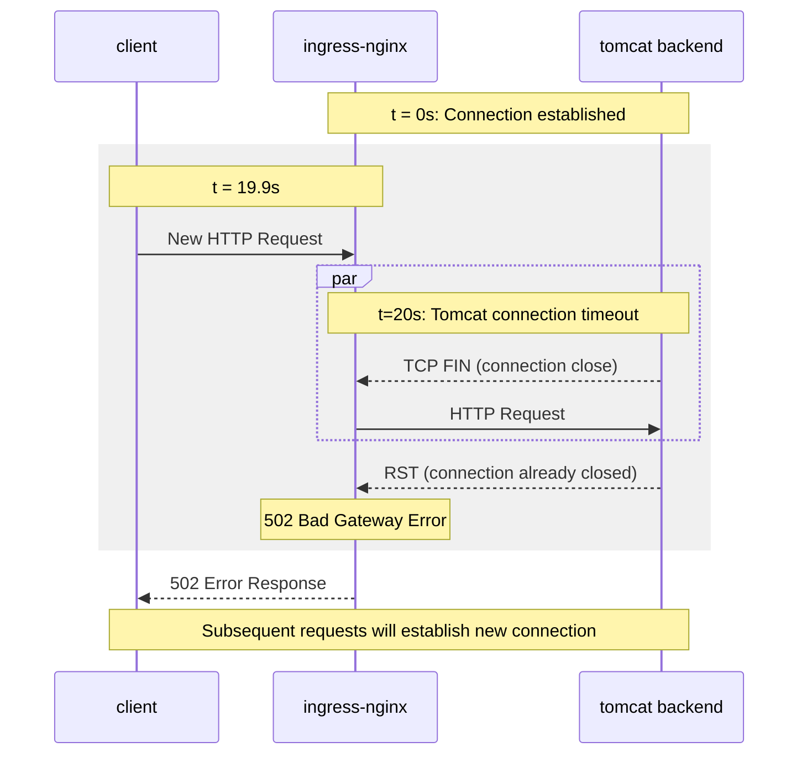

## A little context

I work at PostFinance, taking care of the Linux systems and of the Open-Source
Kubernetes platform we are running to support all sorts of banking workloads.

Aside from running the platform, we also take in user support issues (where
users are internal developers/colleagues), and this blog article covers an
issue named "Ingress gets HTTP 502 errors on high load".

You can take this article as an SRE exercise: I'll provide the same data I
received in the support issue, in the same order, and you should try to
discover the actual issue as soon as possible. Good luck ;)

## The support issue

The short description of the issue was:

> During high loads we sometimes get 502 on the ingress. We cannot really
> explain why. I did not found issues on the pods itself.

This came together with a query on internal logging platform, where a clear
correlation between the amount of requests and the occurrence of 502 errors
could be observed.

Starting there, we started load-testing the application with Grafana K6 to try
and reproduce those 502 errors, but without success. Not a single 502 error
popped up. We also analyzed the distribution of the 502 errors: uniformly
distributed across all ingress-nginx pods.

We also suspected misconfigured CPU/Memory requests for the application, but it
turned out that the CPU limit had already been disabled (i.e. no throttling),
and memory limit was properly configured.

## ingress-nginx logs

After searching the normal logs, where we can filter by ingress name, it came
to my attention that nginx error logs do not contain the ingress name, but the
hostname. In other words, if you encounter errors with an ingress named
`toto-ingress` and filter your logs with that name, you will _not_ see error
logs. Once I discovered that, it became much simpler to discover the true cause
for the 502 errors.

## Reproducing the 502 errors

Equipped with the knowledge that we have to filter by hostname to view error
logs, we started noticing following error entries in our nginx logs:

```log
upstream prematurely closed connection while reading response header from upstream
```

Although we had encountered that warning from the beginning of the issue, as
the 502 errors were only appearing with load, we had focused on load-testing
the application to reproduce the bug, which drew us afar from the actual issue.

During a discussion though, we started suspecting mismatched connection timeout
values between ingress-nginx and the backend application (a Java Tomcat app).
That's when we started modifying our K6 load testing scripts, to simulate
testing scenarios where a great number of requests are made to the backend,
followed by a backoff/pause period. Through playing with intervals, we were
finally able to reproduce the 502 errors, with a script similar to:

```javascript
function generate_stages() {
    var stages = []
    for (let i = 10; i < 25; i++) {
        // load
        stages.push({
            duration: "60s",
            target: 100
        });
        // pause
        stages.push({
            duration: i + "s",
            target: 0
        }, );
    }
    return stages
}

export let options = {
    noConnectionReuse: true,
    noVUConnectionReuse: true,
    scenarios: {
        http_502: {
            stages: generate_stages(),
            executor: 'ramping-vus',
            gracefulRampDown: '1s',
        },
    },
};
```

This testing scenario generates load with increasingly bigger pause intervals,
which is key in triggering the 502 errors.

## A timing issue

The following sequence diagram should help in understanding the issue: because
ingress-nginx is per default configured [with a 60s keepalive
timeout](https://nginx.org/en/docs/http/ngx_http_upstream_module.html#keepalive_timeout),
and because tomcat's default [is a 20 second
timeout](https://tomcat.apache.org/tomcat-10.1-doc/config/http.html#Standard_Implementation),
it sometimes happens that nginx forwards a request to the backend at the exact
same time as the tomcat backend closes the TCP connection.

In our experience, this only happened 8-10 times per day, out of ~1.7 million
daily request for that ingress. It was quite a rare race condition 😅



## Solution

The solution was quite simple: increasing the connection timeout to 75 seconds
on the tomcat backends. Not a single 502 errors to this day, simply by changing
an environment variable:

```shell
if [ -z "${TC_HTTP_KEEPALIVETIMEOUT}" ]; then
    export TC_HTTP_KEEPALIVETIMEOUT="75000" # because NGINX/contour defaults are 60s
fi
```

## Conclusion

In retrospective, it is clear that we focused too much on the correlation
between the load and the occurrence of the 502 errors. Knowing how to filter
and find nginx error logs would also have helped us understand the issue
earlier, and being aware of mismatched connection timeout settings would have
prevented the issue altogether!

But in any case the investigations for this issue were an opportunity to
improve our load-testing "skills" with k6, an occasion to know where to find
nginx errors logs, and we also got to dig deeper into our nginx configuration,
which paved the way for several performance improvements.

In the end we not only prevented 1 out of 170000 requests from failing, we also
shared that knowledge with people impacted on Github, modified the default
config for the tomcat base image we use internally, which will save countless
debugging hours in the future :)
